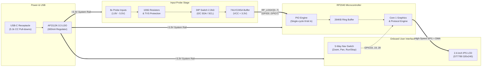

# 8-Channel Standalone & USB Digital Logic Analyzer


A high-speed, 8-channel digital logic analyzer designed around the **Raspberry Pi RP2040** microcontroller. This instrument operates both as a **standalone, handheld on-PCB visualizer** with an integrated 2.4" color IPS LCD and 5-way joystick navigation, or as a **high-throughput USB logic analyzer** compatible with open-source logic analysis suites like [Sigrok / PulseView](https://sigrok.org/).

---

## 🌟 Key Features

* **Dual-Mode Operation:**
  * **Standalone Mode:** View 8-channel waveforms, trigger states, timebase cursors, and real-time protocol decoding directly on the 2.4" IPS screen without needing a PC.
  * **USB Host Mode:** Stream digital waveforms to PC via USB 2.0 Full-Speed using standard Sigrok/PulseView drivers.
* **Wide Voltage Range (1.8V to 5.5V):** Powered by an onboard `74LVC245A` high-speed level translator and input buffer, safe for 1.8V, 2.5V, 3.3V, and 5.0V logic systems.
* **Single-Cycle PIO Capture:** Probe channels mapped to consecutive pins (`GPIO0` to `GPIO7`) allowing the RP2040 Programmable I/O (PIO) state machine to capture all 8 lines in 1 clock cycle (`in pins, 8`).
* **Robust Input Protection:**
  * $100\,\Omega$ series current-limiting resistors on each channel.
  * Low-capacitance ($1.0\,\text{pF}$) `PRTR5V0U2X` TVS clamping diode array.
* **Switchable $I^2C$ Bus Pull-Ups:** Onboard 2-position DIP switch connects $2.2\,\text{k}\Omega$ pull-ups to `CH0` (SDA) and `CH1` (SCL) for debugging un-terminated buses.
* **Clean Power Subsystem:** 600mA Low-Dropout `AP2112K-3.3` regulator with $0.5\,\text{A}$ PTC polyfuse and `USBLC6-2SC6` high-speed USB ESD protection.

---

## 📐 System Architecture



---

## 🗂️ Altium Designer Project Structure

This project uses a **Hierarchical Schematic Architecture** to enforce clean modular design and strict electrical rule checking:

```
RP2040_Logic_Analyzer.PrjPcb
├── Top.SchDoc                 # Master root sheet with Sheet Symbols & Ports
├── 01_Power_USB.SchDoc        # USB-C receptacle, PTC fuse, TVS clamp, and 3.3V LDO
├── 02_MCU_RP2040.SchDoc       # RP2040 MCU, 12MHz crystal, 16MB QSPI Flash, SWD, Reset
├── 03_Input_Buffer.SchDoc     # 10-pin probe header, ESD clamps, DIP switch, 74LVC245 buffer
└── 04_Display_UI.SchDoc       # 2.4" ST7789 IPS LCD interface and 5-way joystick matrix
```

### Altium Directives Configured:
* **Differential Pair Directive:** Assigned to `USB_D_P` and `USB_D_N` targeting $90\,\Omega$ differential impedance.
* **Net Class Directive:** `LOGIC_PROBES` assigned to `RP_LOGIC[0..7]` bus for trace length tuning and clearance rules.
* **ERC Connection Matrix:** Strict pin-type checking (prevents floating inputs and output-to-output conflicts).

---

## 📌 Pinout & Hardware Mappings

### 1. Logic Probe Channel Mapping (PIO Sampling)
| Channel | Function / Protocol Label | Buffer In | Buffer Out | RP2040 GPIO Pin | PIO Instruction |
| :--- | :--- | :--- | :--- | :--- | :--- |
| **CH0** | $\text{I}^2\text{C}$ SDA / UART RX | Pin 2 (`A0`) | Pin 18 (`B0`) | **GPIO0** (Pin 2) | Bit 0 |
| **CH1** | $\text{I}^2\text{C}$ SCL / UART TX | Pin 3 (`A1`) | Pin 17 (`B1`) | **GPIO1** (Pin 3) | Bit 1 |
| **CH2** | SPI SCK | Pin 4 (`A2`) | Pin 16 (`B2`) | **GPIO2** (Pin 4) | Bit 2 |
| **CH3** | SPI MOSI | Pin 5 (`A3`) | Pin 15 (`B3`) | **GPIO3** (Pin 5) | Bit 3 |
| **CH4** | SPI MISO | Pin 6 (`A4`) | Pin 14 (`B4`) | **GPIO4** (Pin 6) | Bit 4 |
| **CH5** | SPI /CS | Pin 7 (`A5`) | Pin 13 (`B5`) | **GPIO5** (Pin 7) | Bit 5 |
| **CH6** | External Trigger / General | Pin 8 (`A6`) | Pin 12 (`B6`) | **GPIO6** (Pin 8) | Bit 6 |
| **CH7** | High-Speed Clock / General | Pin 9 (`A7`) | Pin 11 (`B7`) | **GPIO7** (Pin 9) | Bit 7 |

### 2. Display & UI Controls Mapping
| Peripheral | Signal | RP2040 Pin | Function |
| :--- | :--- | :--- | :--- |
| **ST7789 LCD** | `LCD_SCK` | **GPIO10** (Pin 13) | SPI1 Serial Clock (up to 62.5MHz) |
| **ST7789 LCD** | `LCD_MOSI` | **GPIO11** (Pin 14) | SPI1 Master Out Data |
| **ST7789 LCD** | `LCD_CS` | **GPIO13** (Pin 16) | Display Chip Select (Active Low) |
| **ST7789 LCD** | `LCD_DC` | **GPIO14** (Pin 17) | Data / Command Selection |
| **ST7789 LCD** | `LCD_RST` | **GPIO15** (Pin 18) | Hardware Display Reset |
| **ST7789 LCD** | `LCD_BL` | **GPIO27** (Pin 31) | PWM Backlight Dimming Control |
| **Joystick** | `NAV_UP` | **GPIO16** (Pin 27) | Cursor Up / Channel Select |
| **Joystick** | `NAV_DOWN` | **GPIO17** (Pin 28) | Cursor Down / Channel Select |
| **Joystick** | `NAV_LEFT` | **GPIO18** (Pin 29) | **Zoom Out Timebase** ($1\,\mu\text{s} \rightarrow 100\,\text{ms}$) |
| **Joystick** | `NAV_RIGHT` | **GPIO19** (Pin 30) | **Zoom In Timebase** ($100\,\text{ms} \rightarrow 1\,\mu\text{s}$) |
| **Joystick** | `NAV_ENTER` | **GPIO28** (Pin 32) | **RUN / STOP / Single-Shot Trigger** |

---

## 📊 Key Component Bill of Materials (BOM)

| Component | Part Number | Package | Description |
| :--- | :--- | :--- | :--- |
| **Microcontroller** | `RP2040` | QFN-56 (7x7mm) | Dual-Core ARM Cortex-M0+ MCU |
| **Input Buffer** | `74LVC245APW,118` | TSSOP-20 | 8-Bit Transceiver / Level Shifter |
| **LDO Regulator** | `AP2112K-3.3TRG1` | SOT-23-5 | 3.3V 600mA Low-Dropout Linear Regulator |
| **QSPI Flash** | `W25Q128JVSIQ` | SOIC-8 (208-mil)| 16MB Quad-SPI NOR Flash Memory |
| **USB TVS** | `USBLC6-2SC6` | SOT-23-6 | High-Speed USB ESD Protection Diode |
| **Input TVS** | `PRTR5V0U2X,215` | SOT-143B | Dual Low-Capacitance TVS Clamp Diodes (x4) |
| **Display** | `ST7789-2.4-SPI` | 8-Pin Module | 2.4" 320x240 IPS Color TFT LCD |
| **Joystick** | `SKRHAAE010` | SMT Module | 5-Way Directional Navigation Switch |
| **12MHz XTAL** | `ABM8G-12.000MHZ-18` | 3.2x2.5mm SMD | 12.000MHz Master Crystal Oscillator |
| **USB Connector** | `TYPE-C-31-M-12` | 16-Pin Hybrid | USB Type-C Receptacle |

---

## 🚀 How to Use

### Standalone Handheld Operation:
1. Connect a 5V USB-C power source (phone charger, power bank, or USB port).
2. Connect the probe ground pin (`GND`) to your Device Under Test (DUT) ground.
3. Attach probe channels `CH0`–`CH7` to the target digital lines (e.g., $I^2C$, SPI, or UART).
4. If testing an $I^2C$ bus without onboard pull-ups, flip **DIP Switch 1 & 2** to the `ON` position.
5. Use the **5-Way Joystick**:
   * **Left / Right:** Adjust horizontal timebase ($1\,\mu\text{s}/\text{div}$ to $100\,\text{ms}/\text{div}$).
   * **Up / Down:** Move channel cursors and measurement markers.
   * **Center Push:** Toggle between **RUN** (continuous capture) and **STOP** (freeze buffer).

### USB PC Operation (Sigrok / PulseView):
1. Plug the logic analyzer into a PC via USB-C.
2. Open **PulseView** / **Sigrok**.
3. Select the `Raspberry Pi Pico / RP2040 Logic Analyzer` driver.
4. Set sample rate up to **100 MSPS** across all 8 channels and start capturing.

---

## 📜 License & Acknowledgments
* **Hardware Design:** Open-source hardware under the **CERN Open Hardware Licence Version 2 - Strongly Reciprocal (CERN-OHL-S)**.
* **Firmware Support:** Compatible with open-source RP2040 Logic Analyzer firmware and standard Raspberry Pi Pico SDK.
