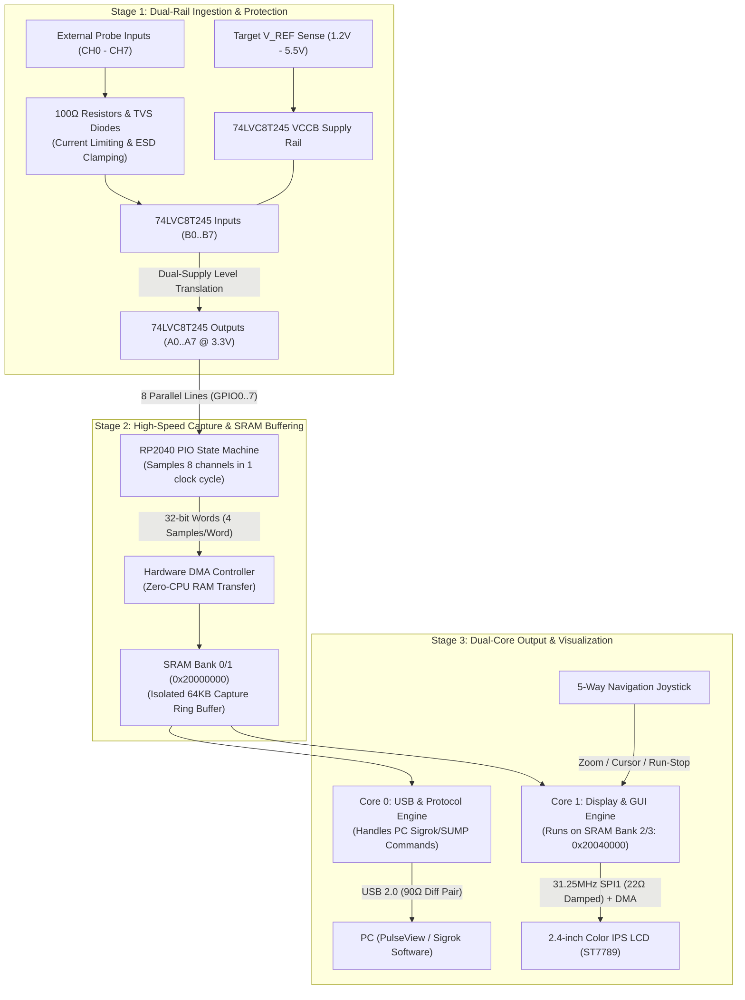
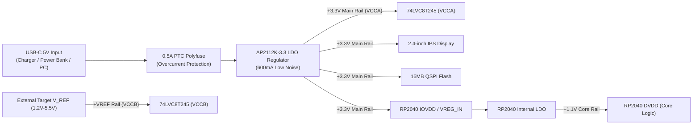

# 8-Channel Standalone & USB Digital Logic Analyzer


An open-hardware, 8-channel digital logic analyzer designed around the **Raspberry Pi RP2040** microcontroller. It operates both as a **standalone, handheld instrument** with a built-in 2.4" color IPS display, and as a **USB logic analyzer** connected to a PC with software like [Sigrok / PulseView](https://sigrok.org/).

---

## 🌟 Key Features

* **Dual Operation Modes:**
  * **Standalone Mode:** Capture, view, and zoom into waveforms on the built-in 2.4" LCD screen using the 5-way navigation joystick without a computer.
  * **USB PC Mode:** Stream live logic data over USB to PC software (Sigrok / PulseView) for protocol decoding.
* **True Dual-Supply Level Shifting (1.2V to 5.5V):** Uses a `74LVC8T245` / `SN74AVC8T245` dual-rail transceiver. Side B ($V_{CCB}$) connects to the target system's $V_{REF}$ pin, and Side A ($V_{CCA}$) connects to the RP2040 3.3V rail. This guarantees correct $V_{IH} / V_{IL}$ thresholds for 1.2V, 1.8V, 2.5V, 3.3V, and 5.0V logic families.
* **Single-Cycle PIO Capture:** Probe channels connect directly to consecutive pins (`GPIO0` to `GPIO7`), allowing the RP2040 Programmable I/O (PIO) state machine to sample all 8 lines simultaneously in 1 clock cycle (`in pins, 8`).
* **Input Protection:** $100\,\Omega$ series resistors and low-capacitance `PRTR5V0U2X` TVS diode clamps protect against static and overvoltage.
* **Switchable $I^2C$ Pull-Ups:** 2-position DIP switch enables onboard $2.2\,\text{k}\Omega$ pull-up resistors on Channel 0 (SDA) and Channel 1 (SCL) referenced to $V_{REF}$.
* **Display Signal Integrity:** $22\,\Omega$ series damping resistors on `LCD_SCK`, `LCD_MOSI`, and `LCD_CS` eliminate ringing and edge reflections on high-speed SPI traces.
* **Crossbar Contention Isolation:** DMA capture buffers are isolated in dedicated SRAM banks, preventing memory bus stalls between Core 0 capture and Core 1 display rendering.

---

## 📐 System Architecture

The instrument is organized into 3 operational pipelines: **Signal Ingestion**, **Core Processing**, and **Dual Output (LCD & USB)**.

### 1. End-to-End Signal & Data Pipeline



---

### 2. Power Distribution Architecture



---

## 📌 Hardware Pinout & Peripheral Mapping

| Subsystem | Signal Name | RP2040 Pin | Buffer / Module Pin | Firmware Mapping | Description |
| :--- | :--- | :--- | :--- | :--- | :--- |
| **Target Power** | `VREF_EXT` | — | `74LVC8T245` VCCB (Pin 24) | — | External Target Reference (1.2V–5.5V) |
| **Logic Probes** | `RP_LOGIC_0` | **GPIO0** (Pin 2) | `74LVC8T245` A0 (Pin 2) | `LOGIC_PIN_BASE + 0` | Channel 0 Input (I2C SDA / UART RX) |
| **Logic Probes** | `RP_LOGIC_1` | **GPIO1** (Pin 3) | `74LVC8T245` A1 (Pin 3) | `LOGIC_PIN_BASE + 1` | Channel 1 Input (I2C SCL / UART TX) |
| **Logic Probes** | `RP_LOGIC_2` | **GPIO2** (Pin 4) | `74LVC8T245` A2 (Pin 4) | `LOGIC_PIN_BASE + 2` | Channel 2 Input (SPI SCK) |
| **Logic Probes** | `RP_LOGIC_3` | **GPIO3** (Pin 5) | `74LVC8T245` A3 (Pin 5) | `LOGIC_PIN_BASE + 3` | Channel 3 Input (SPI MOSI) |
| **Logic Probes** | `RP_LOGIC_4` | **GPIO4** (Pin 6) | `74LVC8T245` A4 (Pin 6) | `LOGIC_PIN_BASE + 4` | Channel 4 Input (SPI MISO) |
| **Logic Probes** | `RP_LOGIC_5` | **GPIO5** (Pin 7) | `74LVC8T245` A5 (Pin 7) | `LOGIC_PIN_BASE + 5` | Channel 5 Input (SPI /CS) |
| **Logic Probes** | `RP_LOGIC_6` | **GPIO6** (Pin 8) | `74LVC8T245` A6 (Pin 8) | `LOGIC_PIN_BASE + 6` | Channel 6 Input (Trigger / General) |
| **Logic Probes** | `RP_LOGIC_7` | **GPIO7** (Pin 9) | `74LVC8T245` A7 (Pin 9) | `LOGIC_PIN_BASE + 7` | Channel 7 Input (Clock / General) |
| **Display SPI** | `LCD_SCK` | **GPIO10** (Pin 13) | ST7789 SCL (22Ω damped) | `PIN_LCD_SCK` (SPI1) | 31.25MHz SPI1 Clock |
| **Display SPI** | `LCD_MOSI` | **GPIO11** (Pin 14) | ST7789 SDA (22Ω damped) | `PIN_LCD_MOSI` (SPI1)| SPI1 Master Out Data |
| **Display Control**| `LCD_CS` | **GPIO13** (Pin 16) | ST7789 CS (22Ω damped) | `PIN_LCD_CS` | Active-Low Chip Select |
| **Display Control**| `LCD_DC` | **GPIO14** (Pin 17) | ST7789 DC (Pin 6) | `PIN_LCD_DC` | Data / Command Selection |
| **Display Control**| `LCD_RST` | **GPIO15** (Pin 18) | ST7789 RES (Pin 5) | `PIN_LCD_RST` | Hardware Display Reset |
| **Display Control**| `LCD_BL` | **GPIO27** (Pin 31) | 2N7002 Gate | `PIN_LCD_BL` | PWM Backlight Dimming |
| **UI Navigation** | `NAV_UP` | **GPIO16** (Pin 27) | Joystick UP | `PIN_NAV_UP` | Channel Select / Cursor Up |
| **UI Navigation** | `NAV_DOWN` | **GPIO17** (Pin 28) | Joystick DOWN | `PIN_NAV_DOWN` | Channel Select / Cursor Down |
| **UI Navigation** | `NAV_LEFT` | **GPIO18** (Pin 29) | Joystick LEFT | `PIN_NAV_LEFT` | Timebase Zoom Out ($1\,\mu\text{s} \rightarrow 100\,\text{ms}$) |
| **UI Navigation** | `NAV_RIGHT` | **GPIO19** (Pin 30) | Joystick RIGHT | `PIN_NAV_RIGHT` | Timebase Zoom In ($100\,\text{ms} \rightarrow 1\,\mu\text{s}$) |
| **UI Navigation** | `NAV_ENTER` | **GPIO28** (Pin 32) | Joystick CENTER | `PIN_NAV_ENTER` | RUN / STOP / Single-Shot Capture |
| **USB 2.0** | `USB_DP / DM` | **Pins 47 / 46** | USBLC6-2SC6 / J1 | TinyUSB Driver | Full-Speed USB Data Pair (90Ω Diff) |
| **QSPI Flash** | `QSPI_SD0..3` | **Pins 51..56** | W25Q128JV | Bootrom / Flash XIP | 16MB High-Speed Flash Bus |

---

## 💻 Firmware Structure

```
firmware/
├── CMakeLists.txt              # Pico SDK CMake build configuration
├── pico_sdk_import.cmake       # Automatic SDK importer
├── README.md                   # Firmware-specific build guide
└── src/
    ├── main.c                  # Dual-core bootloader & task scheduler
    ├── logic_analyzer.pio      # PIO assembly program (single-cycle 8-bit in)
    ├── capture.c / capture.h   # DMA ring buffer & trigger management
    ├── st7789.c / st7789.h     # 31.25MHz SPI1 LCD driver with RGB565 rendering
    ├── ui.c / ui.h             # 8-trace waveform drawing & 5-way joystick handling
    └── sigrok_protocol.c / .h  # SUMP protocol for PulseView/Sigrok over USB CDC
```

---

## 🗂️ Altium Designer Project Structure

```
RP2040_Logic_Analyzer.PrjPcb
├── Top.SchDoc                 # Master root sheet with Sheet Symbols & Ports
├── 01_Power_USB.SchDoc        # USB-C receptacle, PTC fuse, TVS clamp, and 3.3V LDO
├── 02_MCU_RP2040.SchDoc       # RP2040 MCU, 12MHz crystal, 16MB QSPI Flash, SWD, Reset
├── 03_Input_Buffer.SchDoc     # 12-pin probe header, ESD clamps, 74LVC8T245 dual-rail buffer
└── 04_Display_UI.SchDoc       # 2.4" ST7789 IPS LCD with 22Ω damping & 5-way joystick
```

---

## 📊 Key Component Bill of Materials (BOM)

| Component | Part Number | Package | Description |
| :--- | :--- | :--- | :--- |
| **Microcontroller** | `RP2040` | QFN-56 (7x7mm) | Dual-Core ARM Cortex-M0+ MCU |
| **Dual-Rail Buffer** | `74LVC8T245PW,118` | TSSOP-24 | 8-Bit Dual-Supply Level Shifter (1.2V–5.5V) |
| **LDO Regulator** | `AP2112K-3.3TRG1` | SOT-23-5 | 3.3V 600mA Low-Dropout Linear Regulator |
| **QSPI Flash** | `W25Q128JVSIQ` | SOIC-8 (208-mil)| 16MB Quad-SPI NOR Flash Memory |
| **USB TVS** | `USBLC6-2SC6` | SOT-23-6 | High-Speed USB ESD Protection Diode |
| **Input TVS** | `PRTR5V0U2X,215` | SOT-143B | Dual Low-Capacitance TVS Clamp Diodes (x5) |
| **Display** | `ST7789-2.4-SPI` | 8-Pin Module | 2.4" 320x240 IPS Color TFT LCD |
| **Joystick** | `SKRHAAE010` | SMT Module | 5-Way Directional Navigation Switch |
| **12MHz XTAL** | `ABM8G-12.000MHZ-18` | 3.2x2.5mm SMD | 12.000MHz Master Crystal Oscillator |
| **Probe Header** | `68000-112HLF` | 1x12 2.54mm | 12-Pin Header (VREF + 8 Channels + 3 GND) |
| **USB Connector** | `TYPE-C-31-M-12` | 16-Pin Hybrid | USB Type-C Receptacle |

---

## 🚀 How to Build, Flash & Use

### Building & Flashing the Firmware:
```bash
# Clone the repository
git clone https://github.com/anaswarramesh/RP2040_Logic_Analyzer.git
cd RP2040_Logic_Analyzer/firmware

# Create build directory and compile
mkdir build && cd build
cmake -DPICO_SDK_PATH=/path/to/pico-sdk ..
make -j4
```
1. Hold down the **BOOTSEL** tactile switch (`SW2`) on the PCB while connecting to a PC via USB-C.
2. Drag and drop the generated **`logic_analyzer.uf2`** file onto the `RPI-RP2` drive.

### Standalone Handheld Operation:
1. Connect any 5V USB-C power source (power bank or charger).
2. Connect `VREF` (Pin 1 on probe header) to the target system's logic supply rail (1.2V to 5.5V).
3. Connect the probe `GND` pins to the target system ground.
4. Attach probe channels `CH0` to `CH7` to the target digital lines.
5. If testing an un-terminated I2C bus, turn **DIP Switch 1 & 2** `ON` to activate the 2.2kΩ pull-up resistors.
6. Use the **5-Way Joystick**:
   * **Left / Right:** Adjust horizontal timebase ($1\,\mu\text{s}/\text{div} \leftrightarrow 100\,\text{ms}/\text{div}$).
   * **Up / Down:** Select channel and move measurement markers.
   * **Center Push:** Toggle between **RUN** (continuous capture) and **STOP** (freeze buffer).

### USB PC Operation (Sigrok / PulseView):
1. Connect to PC via USB-C.
2. Open **PulseView**.
3. Connect to device using driver `Openbench Logic Sniffer & SUMP compatibles` or `Raspberry Pi Pico Logic Analyzer`.
4. Set sample rate up to **100 MSPS** and capture signals directly into PulseView protocol decoders.

---

## 📜 License & Acknowledgments
* **Hardware Design:** Open-source hardware under the **CERN Open Hardware Licence Version 2 - Strongly Reciprocal (CERN-OHL-S)**.
* **Firmware:** Open-source software under the **MIT License**.
